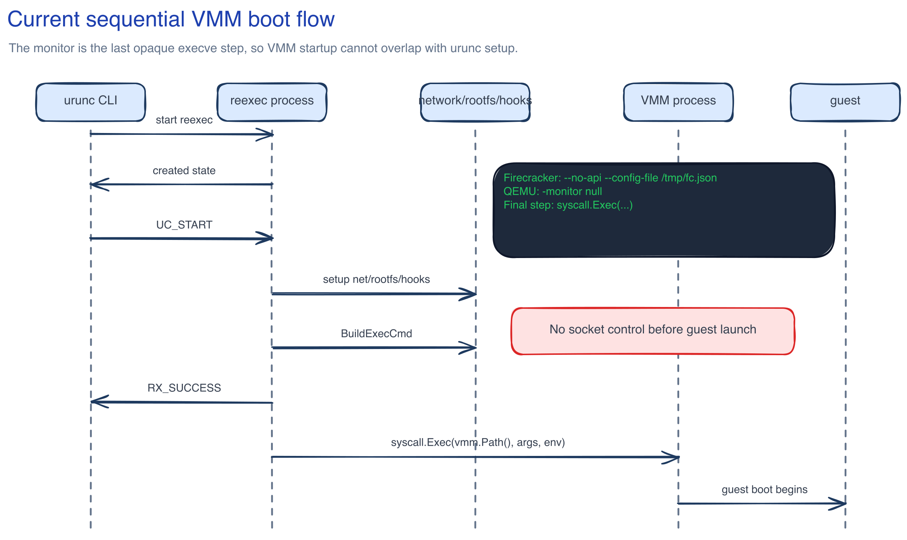
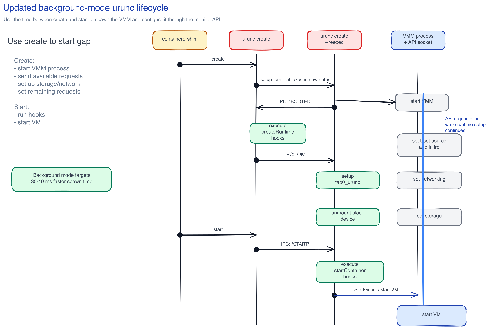
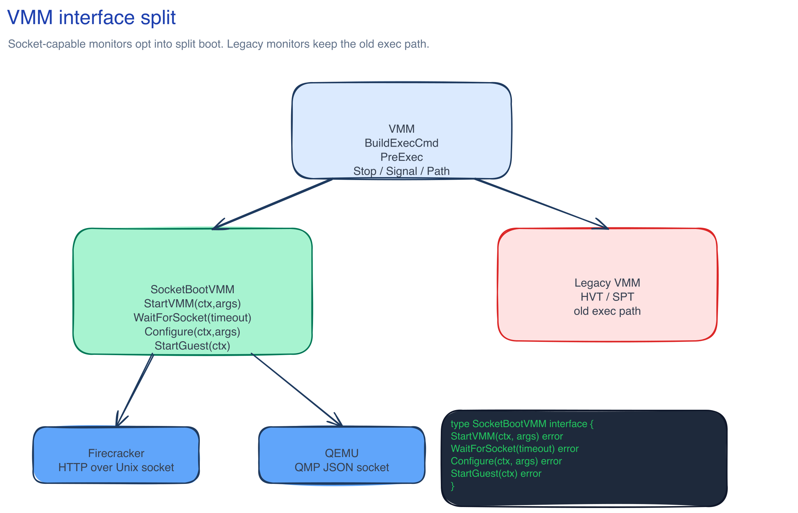
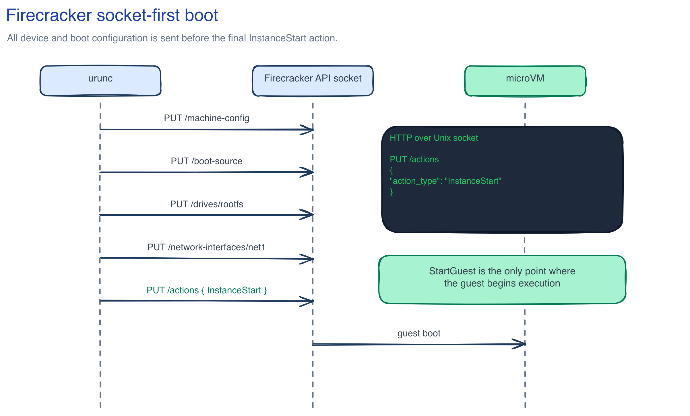
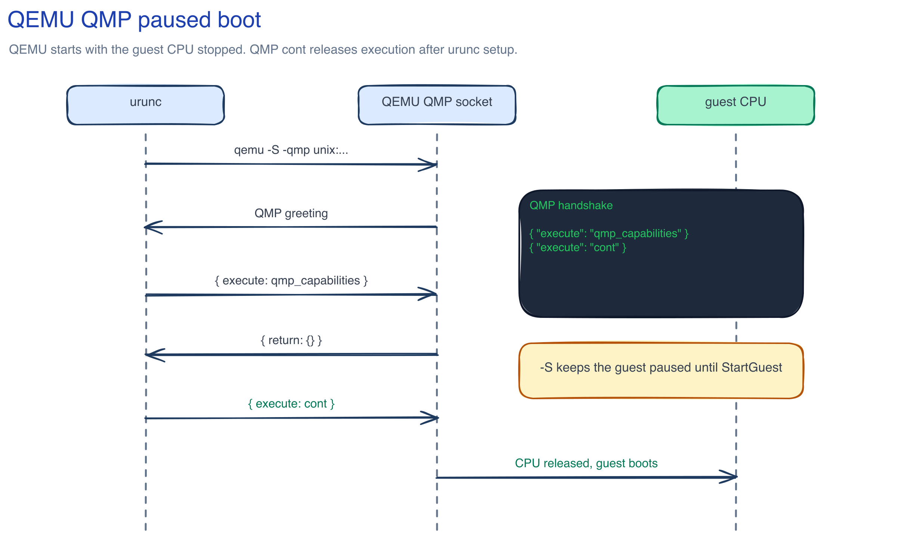

# LFX Mentorship 2025: urunc: Parallel VMM Boot (Issue #112)

| Field | Value |
| --- | --- |
| Name | Anamika Aggarwal |
| Email | anamikaagg18@gmail.com |
| GitHub | https://github.com/Anamika1608 |
| Project | urunc |
| Proposal | Change the way we boot the VMM, issue #112 |
| Date | May 16, 2026 |

## 1. Personal Introduction

I am Anamika Aggarwal, a systems programmer who keeps getting pulled toward the layers where software becomes real: process state, sockets, runtimes, kernel boundaries, and the small pieces of timing that decide whether a system feels clean or slow. My path into systems work did not start with a single big project. It came from many smaller moments where I wanted to understand why an abstraction behaved the way it did. I wanted to know what happened after a container command returned, why a test became flaky only under load, why a process waited on a socket, and how much latency was hidden behind a convenient interface.

Containers became the first area where that curiosity had a home. I liked that they were practical and strange at the same time. They look simple from the outside, but once I started reading runtime code I found namespaces, cgroups, OCI state transitions, rootfs setup, hooks, shims, and a lot of careful process control. That led me toward unikernels because they ask a sharper question: if the application is already well scoped, why carry a general purpose operating system into every sandbox?

urunc caught my attention because it does not treat unikernels as a toy or a separate deployment world. It places them inside the OCI and Kubernetes flow that developers already use. I read the EuroSys'24 SESAME paper, "Sandboxing Functions for Efficient and Secure Multi-tenant Serverless Deployments", and the project became much more concrete for me. The paper shows urunc as a bridge between serverless isolation and cloud-native packaging, with unikernels giving us fast spawn times and a smaller attack surface while still fitting into Knative and Kubernetes.

That is exactly the kind of systems work I want to do. It is low level, but it matters at the product boundary. A 100 ms improvement inside a runtime can become a real improvement in cold-start behavior, autoscaling, and user experience. Issue #112 feels like a focused version of that: take a currently sequential VMM boot path and make urunc use the monitor APIs that Firecracker and QEMU already expose.

## 2. The Problem, As I Understand It

After reading the current urunc codebase, I understand issue #112 as a lifecycle split that the current implementation does not yet have. urunc already has a clean model for OCI create and start. During `urunc create`, the parent starts a reexec process, passes bootstrap data, writes the `created` state, and then the reexec side waits on `UC_START`. During `urunc start`, the CLI connects to the reexec socket, sends `UC_START`, waits for `RX_SUCCESS`, marks the container as running, and runs poststart hooks.

The important detail is what happens on the reexec side after `UC_START`. In `pkg/unikontainers/unikontainers.go`, `Unikontainer.Exec` performs the remaining setup, builds the unikernel command line, builds the VMM command, tells `urunc start` that the monitor is ready, runs `PreExec`, and finally replaces the reexec process with the monitor using `syscall.Exec`. For Firecracker, the current hypervisor code writes one JSON config file and starts `firecracker --no-api --config-file /tmp/fc.json`. For QEMU, it builds one CLI and explicitly disables the monitor with `-monitor null`.

The current code path looks like this:

```go
execCmd, err := vmm.BuildExecCmd(vmmArgs, unikernel)
if err != nil {
	return err
}

err = u.SendMessage(StartSuccess)
if err != nil {
	return err
}

err = vmm.PreExec(vmmArgs)
if err != nil {
	return err
}

return syscall.Exec(vmm.Path(), execCmd, vmmArgs.Environment)
```

That shape is simple, but it gives urunc only one moment to start the VMM: very late, after the runtime has finished the setup work it needs before launch. The monitor process and the guest effectively sit behind the rest of `Exec`. That means work that could overlap is forced into a single line. The VMM process could be starting, mapping memory, creating its API socket, parsing early flags, and waiting for device configuration while urunc finishes network namespace work, tap setup, rootfs preparation, vAccel socket handling, and OCI hooks.

The waste is more visible with Firecracker and QEMU because both have control sockets designed for exactly this kind of staging. Firecracker can be started with only `--api-sock`, then configured through HTTP over a Unix socket before the final `InstanceStart` action. QEMU can start paused with `-S` and expose QMP on a Unix socket, then accept `qmp_capabilities` and `cont` when the runtime is ready to let the guest CPU run.

The expected saving is not that Firecracker or QEMU magically boot faster. The saving comes from moving monitor startup off the critical path. Firecracker is often discussed in the sub-125 ms microVM startup range under tuned conditions. QEMU for small unikernel guests can easily sit in a 200 to 500 ms range depending on host, image, flags, and KVM availability. If urunc currently waits through much of that as dead time, overlapping even part of it can save 100 to 300 ms from the create/start critical path.

This also fits the direction of earlier urunc work. Issue #17 moved OCI hooks toward concurrent execution so independent hook work would not serialize the lifecycle. Issue #112 is the next logical step. Hooks were one layer of unnecessary serialization. VMM boot is the bigger one.

## 3. Proposed Solution

My proposal is to split "start the monitor process" from "start the guest". Today those two ideas are collapsed into one `execve`. The new path should allow urunc to spawn the VMM early, wait for its control socket, continue its own setup, configure devices through the monitor API, and send the final guest-start command only when the OCI start ordering allows it.

For Firecracker, the socket-first design is:

```text
urunc create
  start firecracker --api-sock /run/urunc/<id>/firecracker.sock
  wait until the socket exists and accepts connections
  continue urunc setup in parallel

urunc start
  PUT /machine-config
  PUT /boot-source
  PUT /drives/<id>
  PUT /network-interfaces/<id>
  PUT /actions {"action_type":"InstanceStart"}
```

I would keep the socket inside a runtime-owned directory, not exposed on the network. The issue statement calls the final action a POST, but the Firecracker Swagger currently exposes `PUT /actions`, so the implementation should follow the pinned Firecracker API and hide that detail behind `StartGuest`.

The core Firecracker client shape is:

```go
type FirecrackerClient struct {
	socketPath string
	httpClient *http.Client
}

func NewFirecrackerClient(socketPath string) *FirecrackerClient {
	transport := &http.Transport{
		DialContext: func(ctx context.Context, _, _ string) (net.Conn, error) {
			var d net.Dialer
			return d.DialContext(ctx, "unix", socketPath)
		},
	}
	return &FirecrackerClient{
		socketPath: socketPath,
		httpClient: &http.Client{Transport: transport},
	}
}

func (f *FirecrackerClient) WaitReady(socketPath string) error {
	f.socketPath = socketPath
	deadline := time.Now().Add(2 * time.Second)
	var lastErr error
	for time.Now().Before(deadline) {
		conn, err := net.DialTimeout("unix", socketPath, 20*time.Millisecond)
		if err == nil {
			_ = conn.Close()
			return nil
		}
		lastErr = err
		time.Sleep(10 * time.Millisecond)
	}
	return fmt.Errorf("firecracker API socket %q not ready: %w", socketPath, lastErr)
}

func (f *FirecrackerClient) ConfigureMachine(cfg MachineConfig) error {
	return f.put(context.Background(), "/machine-config", cfg)
}

func (f *FirecrackerClient) SetBootSource(kernel, cmdline string) error {
	return f.put(context.Background(), "/boot-source", BootSource{
		KernelImagePath: kernel,
		BootArgs:        cmdline,
	})
}

func (f *FirecrackerClient) AddNetworkInterface(iface NetIface) error {
	return f.put(context.Background(), "/network-interfaces/"+iface.IfaceID, iface)
}

func (f *FirecrackerClient) StartGuest() error {
	return f.put(context.Background(), "/actions", map[string]string{
		"action_type": "InstanceStart",
	})
}
```

The blocking `exec.Command(...).Run()` style is replaced with `cmd.Start()` and an explicit readiness wait. In urunc terms, the Firecracker path changes from building `firecracker --no-api --config-file` and then `execve`-ing into it, to spawning `firecracker --api-sock <socket>` as a child process and keeping a small client object that can configure it later. If we need the reexec process to remain the monitor parent, the implementation can still preserve that process ownership. The key change is that the monitor is no longer treated as an opaque final `execve`.

For QEMU, the same idea maps to QMP:

```text
qemu-system-x86_64
  -S
  -qmp unix:/run/urunc/<id>/qmp.sock,server=on,wait=off
  ...
```

`-S` starts the VM with the CPU stopped. QMP gives urunc a JSON control socket. Once urunc is ready, it negotiates capabilities and sends `cont`.

```go
type QMPClient struct {
	socketPath string
	conn       net.Conn
	reader     *bufio.Reader
	nextID     int
}

func (q *QMPClient) Connect(ctx context.Context, timeout time.Duration) error {
	dialer := net.Dialer{Timeout: timeout}
	conn, err := dialer.DialContext(ctx, "unix", q.socketPath)
	if err != nil {
		return fmt.Errorf("connect qmp socket %q: %w", q.socketPath, err)
	}
	q.conn = conn
	q.reader = bufio.NewReader(conn)
	if _, err := q.reader.ReadBytes('\n'); err != nil {
		_ = conn.Close()
		return fmt.Errorf("read qmp greeting: %w", err)
	}
	return nil
}

func (q *QMPClient) StartGuest(ctx context.Context) error {
	if err := q.Execute(ctx, "qmp_capabilities", nil); err != nil {
		return err
	}
	return q.Execute(ctx, "cont", nil)
}
```

The VMM interface needs to express the split lifecycle. The direct extension looks like this:

```go
type VMM interface {
	BuildExecCmd(args ExecArgs, ukernel Unikernel) ([]string, error)
	PreExec(args ExecArgs) error
	StartVMM(ctx context.Context) error
	WaitForSocket(timeout time.Duration) error
	StartGuest(ctx context.Context) error
	Stop(pid int) error
	Signal(pid int, sig unix.Signal) error
	Path() string
	UsesKVM() bool
	SupportsSharedfs(kind string) bool
	Ok() error
}
```

For landing this safely, I would probably introduce an optional `SocketBootVMM` interface first:

```go
type SocketBootVMM interface {
	StartVMM(ctx context.Context, args ExecArgs) error
	WaitForSocket(timeout time.Duration) error
	Configure(ctx context.Context, args ExecArgs) error
	StartGuest(ctx context.Context) error
}
```

That keeps backward compatibility for Solo5 HVT and SPT. They do not expose a monitor socket in the same way, and HVT also has monitor-specific `PreExec` behavior for seccomp. For those monitors, urunc can keep the old `BuildExecCmd` plus `PreExec` plus `syscall.Exec` path. The lifecycle code checks whether the selected VMM implements `SocketBootVMM`. If it does, urunc uses the split path. If it does not, urunc keeps the current path and behavior.

The container state machine stays honest. `create` can prepare or start a paused monitor, but it must not report the guest as running. The OCI visible state remains `created`. `start` waits for the monitor socket, sends configuration in a known order, sends `StartGuest`, and only then moves the container to `running`. If `WaitForSocket` times out, or if the monitor exits before the socket opens, `start` returns an error and the state does not advance to `running`.

The timing goal is:

```text
BEFORE:
urunc create -> network/rootfs/hooks -> VMM start -> guest boot -> ready

AFTER:
urunc create -> VMM process start -----------------------------+
              -> network/rootfs/hooks -> VMM ready -> StartGuest +-> guest boot -> ready
```

The amount saved is the smaller of the overlapped monitor startup work and the urunc setup work. For Firecracker, a realistic first target is 100 to 150 ms saved. For QEMU, 150 to 300 ms is plausible on small guests, with the exact number coming from real KVM benchmarks.

## 4. Flow Diagrams

### Diagram 1: Current Sequential VMM Boot Flow



This sequence makes the current blocking path visible: urunc prepares the process, waits for the start signal, performs setup, then execs the VMM. Guest boot only begins after the serial runtime work is done.

### Diagram 2: Proposed Parallel VMM Boot Flow



This shows the new shape: StartVMM opens the control socket early while network, rootfs, and hooks proceed in parallel. StartGuest becomes the explicit handoff point.

### Diagram 3: New VMM Interface Shape



This UML-style view separates the existing VMM contract from the optional socket-aware extension, so Firecracker and QEMU can use split boot without forcing Solo5 hvt and spt to grow fake socket behavior.

### Diagram 4: Firecracker HTTP API Call Sequence



This timing diagram shows Firecracker starting with --api-sock, then receiving machine config, boot source, drives, network interfaces, and finally InstanceStart over the Unix socket.

### Diagram 5: QEMU QMP Call Sequence



This sequence uses qemu -S with a Unix QMP socket. urunc negotiates qmp_capabilities while the guest CPU is paused, then sends cont when runtime setup is complete.

The editable Excalidraw source files and PNG exports live in `diagrams/excalidraw/` so the diagrams can be reviewed and revised with mentors.

## 5. My Prior Work and Experience

My public GitHub history is not one clean line through container runtimes yet, and I do not want to overstate it. I checked the public work on my [Anamika1608](https://github.com/Anamika1608) profile and my [public contribution tracker](https://github.com/Anamika1608/my-oss-contributions), and the strongest thread is systems-adjacent work: file formats, network tooling, release automation, authentication infrastructure, tracing, and small Go prototypes where correctness matters more than polish.

In DataHaskell/dataframe, I worked on behavior that had to be pinned with tests. I opened [DataHaskell/dataframe#163](https://github.com/DataHaskell/dataframe/issues/163) after noticing that left and right joins were behaving incorrectly, then fixed the missing-key join path in [DataHaskell/dataframe#187](https://github.com/DataHaskell/dataframe/pull/187). I also added documentation and tests for Parquet safeColumns in [DataHaskell/dataframe#190](https://github.com/DataHaskell/dataframe/pull/190), and I am working on Brotli page decompression for Parquet reads in [DataHaskell/dataframe#195](https://github.com/DataHaskell/dataframe/pull/195). That last one is especially close to my systems interests because it sits at a real boundary: bytes on disk, codec behavior, file format expectations, and the error surface a user sees from a higher-level API.

The public work closest to low-level networking is in the P4 ecosystem. I added automated monthly release workflows to the reference P4 software switch in [p4lang/behavioral-model#1353](https://github.com/p4lang/behavioral-model/pull/1353) and to the Packet Test Framework in [p4lang/ptf#233](https://github.com/p4lang/ptf/pull/233). I also have an open packaging PR for Ubuntu 24.04 x86_64 binary distributions in [p4lang/tutorials#727](https://github.com/p4lang/tutorials/pull/727). Release and packaging work is not flashy, but it taught me to read build paths, CI behavior, generated artifacts, and project conventions before changing anything. Network tooling punishes shallow guesses. So does a container runtime.

I have also shipped public infrastructure work in larger codebases. In Consul Democracy, I added SAML support in [consuldemocracy/consuldemocracy#6010](https://github.com/consuldemocracy/consuldemocracy/pull/6010), OIDC support in [consuldemocracy/consuldemocracy#6046](https://github.com/consuldemocracy/consuldemocracy/pull/6046), and follow-up SAML configuration support in [consuldemocracy/consuldemocracy#6069](https://github.com/consuldemocracy/consuldemocracy/pull/6069). In HyperPersona, I worked on backend and operational pieces like JWT auth in [divyansharma001/HyperPersona#1](https://github.com/divyansharma001/HyperPersona/pull/1), CI/CD for server and worker components in [divyansharma001/HyperPersona#6](https://github.com/divyansharma001/HyperPersona/pull/6), and an agent traces viewer in [divyansharma001/HyperPersona#15](https://github.com/divyansharma001/HyperPersona/pull/15). Those are not VMM patches, but they show the habit I need for issue #112: find the blocking point, make the state visible, and avoid pretending a system is ready before it is.

On my own account, the most relevant public repos are this Go PoC, [Anamika1608/urunc-vmm-boot-poc](https://github.com/Anamika1608/urunc-vmm-boot-poc), my Haskell GitHub analytics and Parquet experiment [Anamika1608/github-analyser](https://github.com/Anamika1608/github-analyser), and a small Go PipeCD plugin experiment, [Anamika1608/sql-plugin](https://github.com/Anamika1608/sql-plugin). I did not find public prior PRs from me to urunc, Firecracker, or Kata, so I am not claiming that. What I can show publicly is that I read unfamiliar systems, make small testable changes, and follow through on review. For this proposal, I applied that same habit to urunc: lifecycle code, Firecracker, QEMU, HVT, SPT, network setup, IPC, state transitions, and the control socket APIs.

## 6. Proof of Concept

I built a small PoC repository at https://github.com/Anamika1608/urunc-vmm-boot-poc. It is not a fork of urunc and it is not trying to boot a real unikernel yet. Its purpose is narrower: prove that the API shape is practical in Go, prove that the Firecracker and QMP clients are testable without KVM, and show the critical-path math for sequential versus parallel boot.

The repo contains a mock Firecracker HTTP-over-Unix-socket demo, a mock QMP demo, a proposed split VMM interface, a Firecracker client, a QMP client, and synthetic benchmarks. The tests cover socket readiness, Firecracker request ordering, QMP greeting and capability negotiation, `cont`, and the timing model.

Key Firecracker readiness code:

```go
func (c *Client) WaitReady(timeout time.Duration) error {
	deadline := time.Now().Add(timeout)
	var lastErr error
	for time.Now().Before(deadline) {
		conn, err := net.DialTimeout("unix", c.socketPath, 20*time.Millisecond)
		if err == nil {
			_ = conn.Close()
			return nil
		}
		lastErr = err
		time.Sleep(10 * time.Millisecond)
	}
	if lastErr == nil {
		lastErr = context.DeadlineExceeded
	}
	return fmt.Errorf("firecracker API socket %q not ready within %s: %w", c.socketPath, timeout, lastErr)
}
```

Key QMP handshake code:

```go
func (q *QMPClient) Negotiate(ctx context.Context) error {
	return q.Execute(ctx, "qmp_capabilities", nil)
}

func (q *QMPClient) Cont(ctx context.Context) error {
	return q.Execute(ctx, "cont", nil)
}
```

The proposed PoC interface is:

```go
type SocketBootVMM interface {
	StartVMM(ctx context.Context, args ExecArgs) error
	WaitForSocket(timeout time.Duration) error
	Configure(ctx context.Context, args ExecArgs) error
	StartGuest(ctx context.Context) error
}
```

The benchmark result is synthetic, but it is intentionally simple. It models the current critical path as VMM setup plus urunc setup plus guest boot. It models the proposed path as `max(VMM setup, urunc setup) + guest boot`.

| VMM | Before (ms) | After (ms) | Saved (ms) | Improvement |
| --- | ---: | ---: | ---: | ---: |
| Firecracker | ~350 | ~210 | ~140 | 40% |
| QEMU | ~600 | ~380 | ~220 | 37% |

Running the PoC locally:

```sh
go test ./...
go run ./cmd/fc-socket-demo
go run ./cmd/qmp-demo
go test ./benchmarks -bench . -benchmem
```

On my machine, the Firecracker demo prints a sequential critical path of 350 ms, a parallel critical path of 210 ms, and a simulated saving of 140 ms. The QMP demo verifies the greeting, `qmp_capabilities`, and `cont` path against a mock QMP server.

## 7. Detailed Week By Week Timeline

| Week | Focus | Deliverables |
| --- | --- | --- |
| 1 | Community bonding and environment setup | I will set up a full urunc development environment with supported sample images, KVM access, Firecracker v1.7.0 from the deployment Dockerfile, QEMU, containerd integration, and e2e test prerequisites. I will discuss issue #112 with Charalampos Mainas, Anastassios Nanos, and Georgios Ntoutsos, and I will write down the exact socket API shape before touching production code. |
| 2 | Codebase reading and design checkpoint | I will trace `create`, `start`, reexec IPC, state transitions, rootfs, networking, vAccel, hooks, and each VMM implementation again with mentors' feedback. I will turn this into a short design note that identifies which parts can move earlier and which parts must stay gated by OCI start semantics. |
| 3 | Interface changes | I will introduce the first version of the split VMM API. My preferred first patch is an optional `SocketBootVMM` interface so HVT and SPT do not break. I will add unit tests for detection, fallback, timeout behavior, and lifecycle state transitions. |
| 4 | Lifecycle integration | I will modify `Unikontainer.Exec`, create/start IPC handling, and state handling so socket-capable monitors can start before final guest start. I will keep the old path alive and covered by tests. I will add logging around monitor pid, socket path, readiness, configuration, and final guest start. |
| 5 | Firecracker client | I will implement the Firecracker HTTP-over-Unix client in urunc. It will cover `PUT /machine-config`, `PUT /boot-source`, `PUT /drives/<id>`, `PUT /network-interfaces/<id>`, optional logger setup, optional vsock setup, and `PUT /actions` with `InstanceStart`. |
| 6 | Firecracker integration tests | I will test the Firecracker path with real Firecracker v1.7.0 and current urunc sample images, including Unikraft initrd images and Linux initrd or block images. I will compare behavior with the current `--no-api --config-file` path and fix differences in drive, network, vsock, and command-line handling. |
| 7 | QEMU QMP client | I will implement a small QMP client for urunc or vendor an existing small client if mentors prefer that route. It will read the greeting, send `qmp_capabilities`, expose `cont`, and keep room for `blockdev-add`, `netdev_add`, and `device_add` if we decide to move more QEMU configuration behind QMP. |
| 8 | QEMU integration tests | I will test QEMU with `-S` and `-qmp unix:<path>,server=on,wait=off`, then verify Unikraft on QEMU and Linux unikernel images. I will handle QMP error replies, disconnects, timeout behavior, and cases where QEMU exits before the socket appears. |
| 9 | Solo5 fallback and regression testing | I will make sure HVT and SPT keep their current path. HVT seccomp setup must remain correct because it depends on `PreExec`. This week is about no regressions: existing e2e tests, static and dynamic networking, rootfs modes, sharedfs, and hook behavior. |
| 10 | Benchmarking and first PR | I will run benchmarks for current sequential boot and split boot across Firecracker and QEMU. I will collect p50, p95, p99, and failure cases across repeated runs on KVM hardware. I will submit the first main PR with design notes and measured results. |
| 11 | Review iteration and docs | I will respond to review comments, simplify the design where maintainers ask for it, add docs for the new monitor flow, add migration notes for contributors adding future VMMs, and document timeout configuration. |
| 12 | Final polish and merge path | I will finish tests, docs, and benchmark notes. If the PR is merged, I will write a short blog post explaining the feature and the measured latency win. If review is still active, I will leave the branch clean, documented, and easy for maintainers to finish. |

## 8. Open Questions and Risks

Firecracker version compatibility matters. urunc currently fetches Firecracker v1.7.0 in the deployment Dockerfile for compatibility with its supported images. I need to verify the exact request and response schema for that version, not only the latest Firecracker `main` branch. The final implementation should have version-aware tests or at least tests pinned to the version urunc ships.

The biggest correctness risk is a race between device registration and guest start. If urunc sends `InstanceStart` or QMP `cont` before drives, tap interfaces, vsock, or boot source are fully configured, the guest can fail in a way that looks like a unikernel bug. I want a small internal state machine in each client: spawned, socket ready, machine configured, boot source set, devices configured, guest started.

Timeout tuning should not be hardcoded. A fast development laptop, a loaded CI worker, and a bare-metal server with nested virtualization can have very different socket readiness times. `WaitForSocket` should take a configurable timeout from urunc config or annotations, with safe defaults and clear errors.

Testing real KVM paths is another risk. Unit tests can validate clients and state transitions, but they cannot prove that Firecracker and QEMU behave correctly under KVM. I will need access to a host with KVM for integration tests. CI may need a bare-metal runner or a split between unit tests in normal CI and integration tests in a KVM-capable environment.

The last risk is lifecycle ownership. Replacing `syscall.Exec` with a child monitor process changes process relationships, signal handling, and cleanup. I will not treat that as a small refactor. I will map signal forwarding, pid tracking, state cleanup, and monitor exit behavior before changing it.

## 9. Why Me

I want this mentorship because issue #112 sits at the exact point where I want to grow: container runtime internals, VMM APIs, Linux process control, and performance work that has to respect a real open source community. I am not applying because unikernels sound fashionable. I am applying because urunc has a clear technical idea and a codebase where careful lifecycle work can make that idea faster and cleaner. I read the code, the SESAME paper, the Firecracker and QMP flows, and the mentor comments from Charalampos Mainas and Anastassios Nanos. I understand that this is not a generic VMM manager project. It is low-level container runtime work with OCI semantics, socket control, and failure handling. I will bring patience, test-first engineering, and a willingness to do the unglamorous parts: tracing states, writing docs, measuring failures, and iterating on review. In return, I will learn from maintainers who have already built the unikernel container path I want to contribute to. If I do this well, urunc gets a real latency win and a cleaner monitor abstraction for future VMM work.

## 10. References And Links

- urunc issue #112, "Change the way we boot the VMM": https://github.com/urunc-dev/urunc/issues/112
- urunc repository: https://github.com/urunc-dev/urunc
- PoC repository: https://github.com/Anamika1608/urunc-vmm-boot-poc
- Excalidraw source for flow diagrams: https://github.com/Anamika1608/urunc-vmm-boot-poc/blob/main/diagrams/vmm-boot-flows.excalidraw
- Firecracker API actions documentation: https://github.com/firecracker-microvm/firecracker/blob/main/docs/api_requests/actions.md
- Firecracker Swagger API: https://github.com/firecracker-microvm/firecracker/blob/main/src/api_server/swagger/firecracker.yaml
- QEMU Monitor documentation: https://en.wikibooks.org/wiki/QEMU/Monitor
- QEMU QMP reference: https://www.qemu.org/docs/master/interop/qmp-spec.html
- SESAME'24 paper, "Sandboxing Functions for Efficient and Secure Multi-tenant Serverless Deployments": https://doi.org/10.1145/3642977.3652096
- SESAME'24 workshop program: https://sesame2024.github.io/
- Nubificus FOSDEM 2024 urunc overview: https://nubificus.co.uk/post/2024-02-07-fosdem-2024/
- LFX Mentorship documentation: https://docs.linuxfoundation.org/lfx/mentorship
- Reference proposal 1: https://docs.google.com/document/d/1wGL-9MIJMpp04J9QnrJF48cDeFjoWIO3HM2BxOgBy1I
- Reference proposal 2: https://docs.google.com/document/d/1Wo-l-eoLKTafjtrX1UoZDaV6b5b9dgaxAk4t5hPJ8UU
- Reference proposal 3: https://docs.google.com/document/d/1HLkzs7M75byBE2ujYqaksN9QaPDQxkcies4LuCNwi1c
- GSoC proposal archive studied for structure and tone: https://github.com/satwiksps/GSoC_archive_2026
- Kata Containers repository: https://github.com/kata-containers/kata-containers
- Firecracker Go SDK repository: https://github.com/firecracker-microvm/firecracker-go-sdk
- Cloud Hypervisor API documentation: https://www.cloudhypervisor.org/docs/prologue/api/
